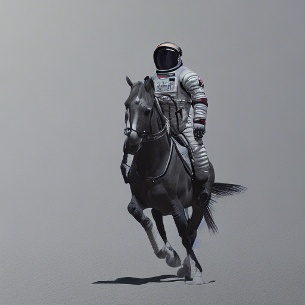
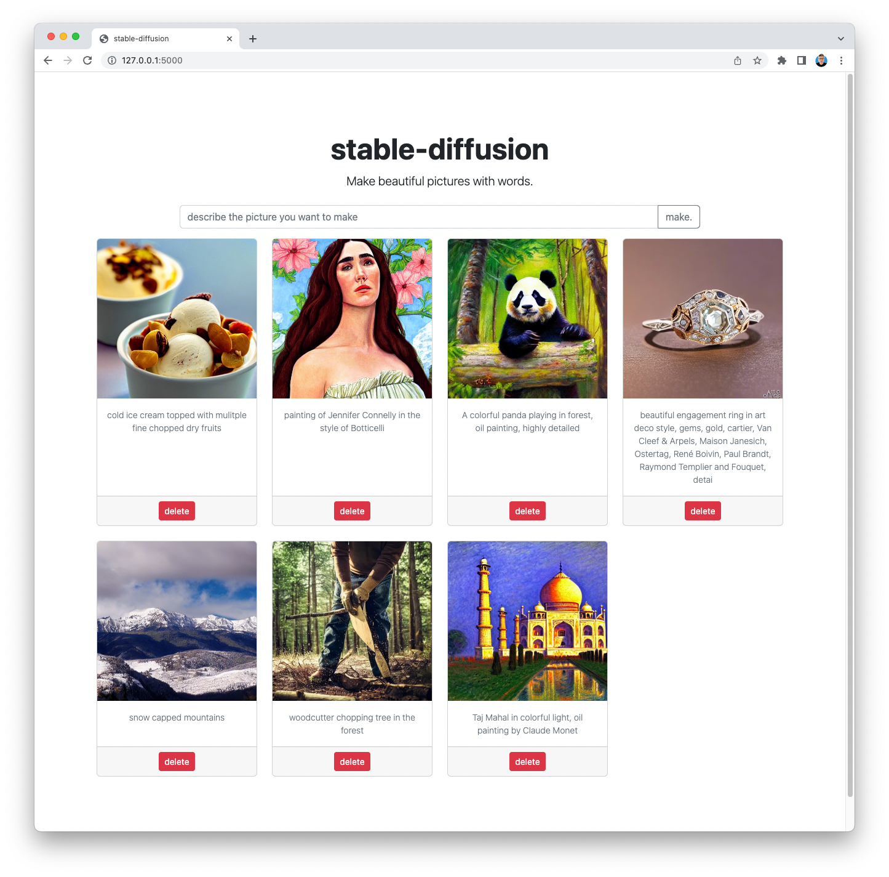

# Stable Diffusion for Mac M series machines

This is a fork of the popular CompVis Stable-Diffusion repository, taken from @bfirsh's fork that was enabled for MacOS M series (M1, M2) machines, using Apple's Metal Performance Shaders (MPS). 

The [original README is here](README.orig.md).

I ran this on my M1 Pro MacBook Pro with 32GB of RAM and it generates 1 512x512 images in around 1.5 minutes.

## Deploying Stable Diffusion

Here are the steps to deploy Stable Diffusion on your M1/M2 machine. I used conda because that's what I'm used to but you can also use pip like @bfirsh. If you're not sure how to use conda, you can [download it here](https://www.anaconda.com/products/distribution).

### Download the repository

Download the repository from Github.

````
$ git clone https://github.com/sausheong/stable-diffusion.git
````

### Download the weights

Go into the repository directory and create a directory to store your weights.

````
$ cd stable-diffusion
$ mkdir -p models/ldm/stable-diffusion-v1/
````

Go to the Hugging Face repository (https://huggingface.co/CompVis/stable-diffusion-v-1-4-original) and download the `sd-v1-4.ckpt` file (it's about 4GB) and save it as `models/ldm/stable-diffusion-v1/model.ckpt`. 


### Install Python 3.10

You need Python 3.10 to run Stable Diffusion. Create a separate environment for running Stable Diffusion and activate it.

````
$ conda create -n sd python=3.10
$ conda activate sd
````


### Install the requirements

Install all the dependencies.

````
(sd) $ pip install -r requirements.txt
````

I find that I need to install OpenCV separately through conda before it works, but your mileage might differ.

````
$ conda install opencv
````

If you're seeing errors like Failed building wheel for onnx you might need to install these packages:

````
$ brew install Cmake protobuf rust
````

### Checking if the installation works

Try running the `txt2img.py` script:

````
$ python scripts/txt2img.py --prompt "astronaut riding a horse in photorealistic style"
````

You should get something like this in the `outputs/txt2img-samples/samples` directory.



## Stable Diffusion webapp

I added in a simple webapp that will generate single images and display in a gallery together with the text prompts.



To start the web app, go to the `webapp` directory and run the web app.

````
$ cd webapp
$ flask run
````

